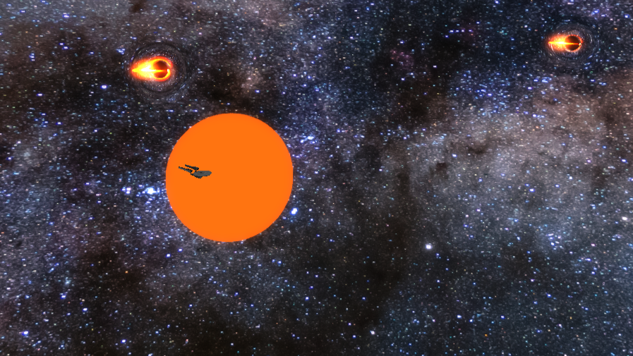
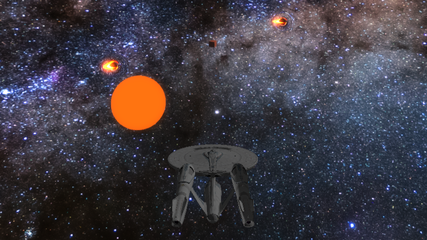
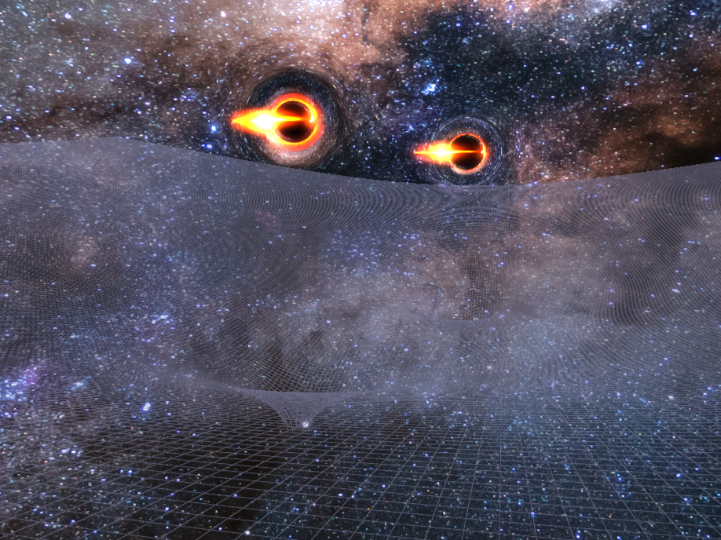
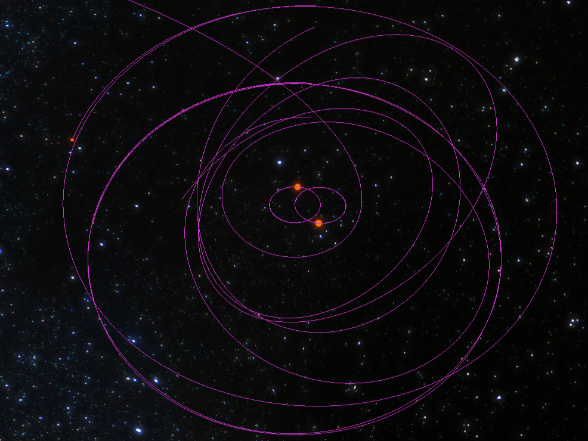

# This is the MOLEHOLE Project!

Welcome to the GitHub page of the MoleHole project!
This project is all about the simulation of cosmic objects and
especially the visualisation of black holes.
For the rendering of these objects ray tracing and ray marching is used
in an OpenGL environment developed with C++.

## Overview

For getting a view of the application, a screenshot of it is provided.

## Scientific Accuracy

This project mainly aims to develop scientific skills, so scientific accuracy
is obviously very important to the team.
The most important theories for this project are the theory of general relativity,
the doppler effect, blackbody radiation, accretion disks and their temperature as well as
Newton's theory of gravitation.
Other theories and effects the project aims to implement in future are tidal forces and 
particle simulations for the formation of accretion disks.

## Rendering

Rendering techniques include Ray Tracing, Ray Marching and Anti Aliasing.

## Application Examples

A few examples of the application are included below. There are pictures of the visualisation of 
spacetime curvature, paths for objects in simulations as well as camera perspectives.

## Science

