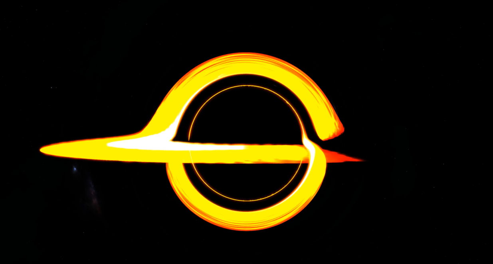
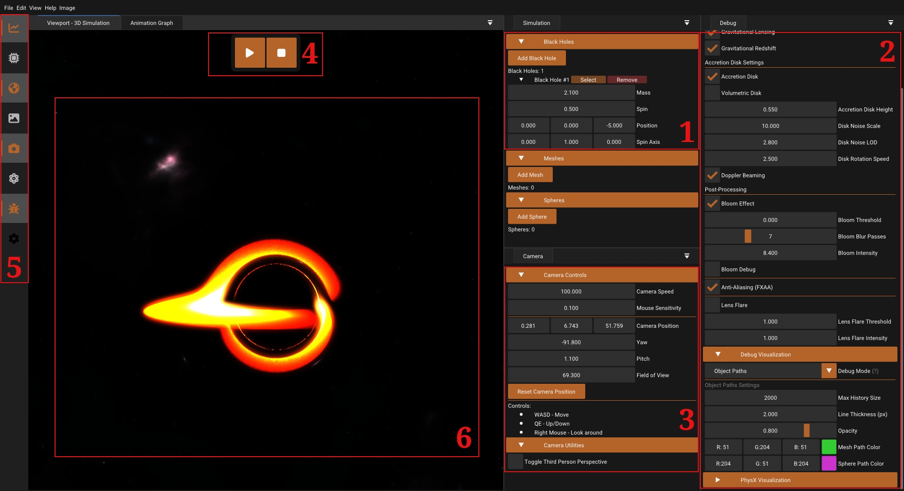
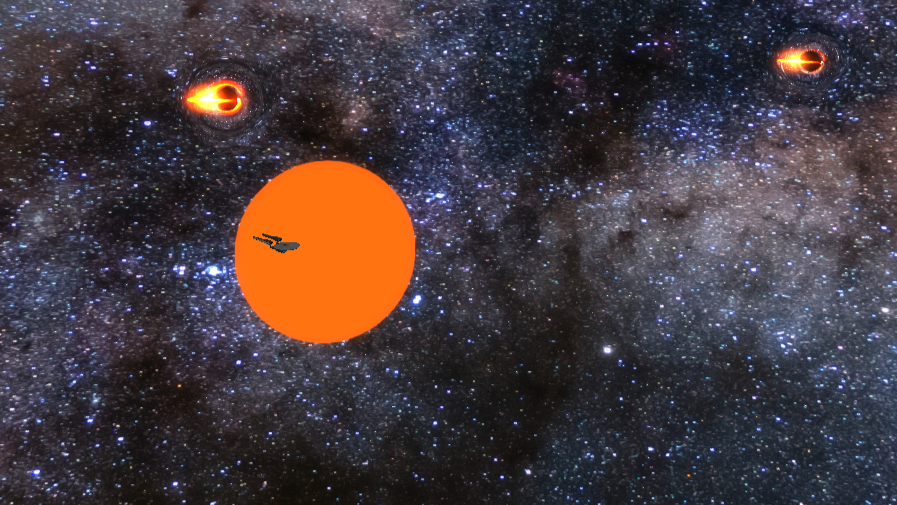
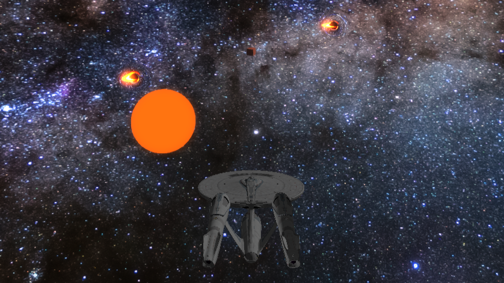
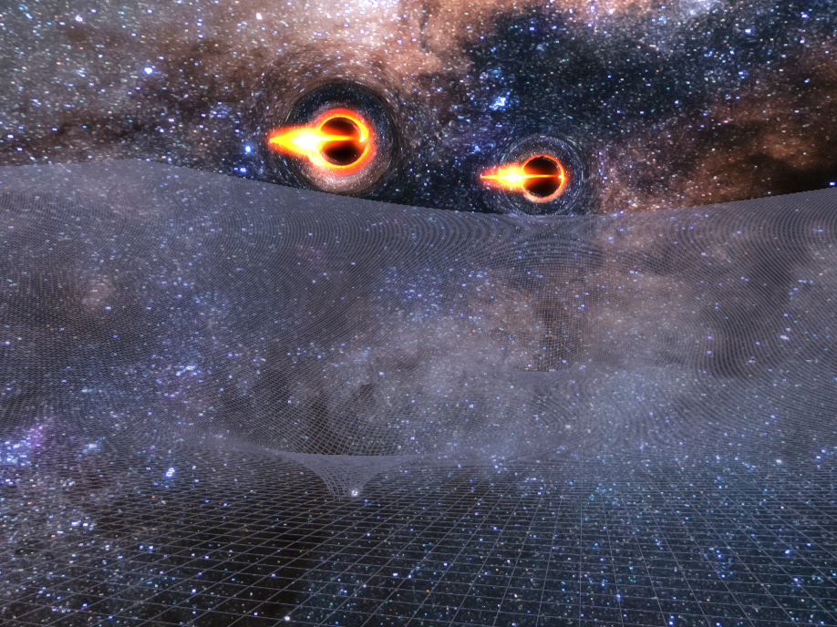
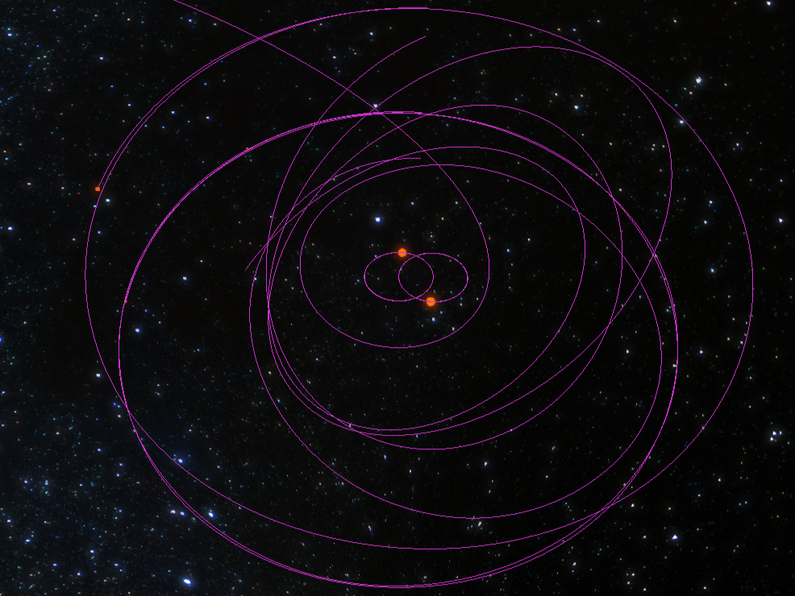

# This is the MOLEHOLE Project!

Welcome to the GitHub page of the MoleHole project!
This project is all about the simulation of cosmic objects and
especially the visualisation of black holes.
For the rendering of these objects ray tracing and ray marching is used
in an OpenGL environment developed with C++.

## Overview

For getting a view of the application, a screenshot of it is provided.

### 1 - Scene Objects

One has the possibility of adding scene objects to a scene, such as black holes,
spheres or meshes. Those objects have various parameters which may be changed.
Furthermore, objects can be selected and transform as well, where a selected object
is highlighted in the viewport (6) and seen in this menu.

### 2 - Debug

The debug window provides some utilities that include the adjustment of bloom parameters,
the enabling of a varierty of effects. There are also debug layers to add to the 
visualisation. Those are: rendering of gravity wells, object trace paths for a simulation 
and PhysX debug layers. The debug layers should help a user understand effects and theories,
such as General Relativity. The first two debug layers are showcased in the Examples section 
below.

### 3 - Camera

These are the settings for the camera. FOV and speed can be adjusted as well as the default 
parameters position, pitch and yaw. There is also an option for enabling the third person
camera as seen in a screenshot furhter below.

### 4 - Simulation

With these two icons, one may start, pause and stop a simulation. A simulation currently
supports the visualisation of the effect of gravitation with an addition of object trace paths.

### 5 - Navigation

For easier navigation, a sidebar is implemented, where each window may be toggled. The settings 
are also accessible from here.

### 6 - Viewport

This is where the magic happens! All configurations and adjustments of parameters will take their
final form in the real time rendering in this window.

## Scientific Accuracy

This project mainly aims to develop scientific skills, so scientific accuracy
is obviously very important to the team.
The most important theories for this project are the theory of general relativity,
the doppler effect, blackbody radiation, accretion disks and their temperature as well as
Newton's theory of gravitation.
Other theories and effects the project aims to implement in future are tidal forces and 
particle simulations for the formation of accretion disks.

## Rendering

Rendering techniques include Ray Tracing, Ray Marching and Anti Aliasing.

## Application Examples

A few examples of the application are included below. There are pictures of the visualisation of 
spacetime curvature, paths for objects in simulations as well as camera perspectives.

## Science

If you are interested in the scientific background of this project, check out the section
[Papers](docs/public/papers.md). Currently, there is only one paper available, which was handed
in for the "Jugend Innovativ" contest in Austria. (https://www.jugendinnovativ.at/) 
But there are more to come!

## Development

For information regarding the development, refer to the  [Developer Notes](docs/public/development.md).

